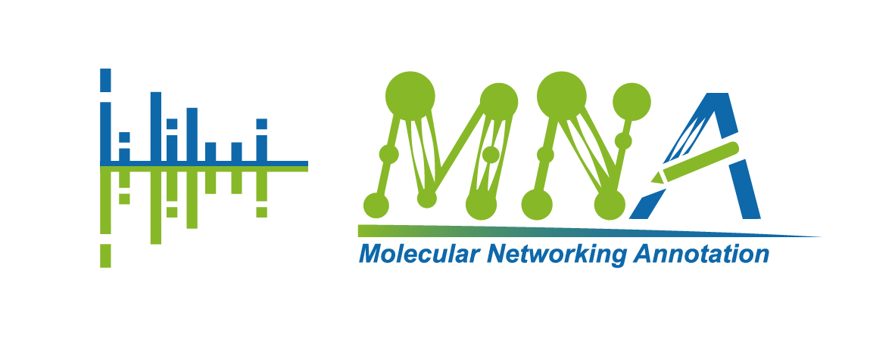

# Molecualr Networking Annotation (MNA)
This repository contains the original source code of MNA

# Installation
## Requirements
MNA requires Python version 3.8+ and dependency packages can be installed with pip or conda.

`pip install -r requirements.txt`

### or
`conda create  -n MNA -f MNA.yml`

The compressed files of MNA library are tracked by git LFS and should be first unzip to the current folder.
# Quickstart
Before applying MNA, raw mass spectrometry (MS) data should be converted using [MSconvert](https://mzmine.github.io/mzmine_documentation/data_conversion.html). 
It is recommended to use [MZmine-based untargeted LC-MS workflow](https://mzmine.github.io/mzmine_documentation/workflows/lcmsworkflow/lcms-workflow.html) 
to generate the `quant.csv` and `mgf` files as inputs. 

Using `-h` for help messages and there are two subcommands in MNA: 

`main` for Default analysis workflow of MNA.

`mn` for quick re-analysis of the results generated by `main` command.

Here we briefly introduce the command of MNA quick start:

`python MNA.py main -q /example/example_quant.csv -m example.mgf`

# 
MNA was carefully tested, bugs may appear. 
Don't hesitate to contact us if you find any, or even better, send a pull request or open an issue. 
For other inquiries, please send an email to 2112007282@zjut.edu.cn and we will be happy to answer you 😄.
